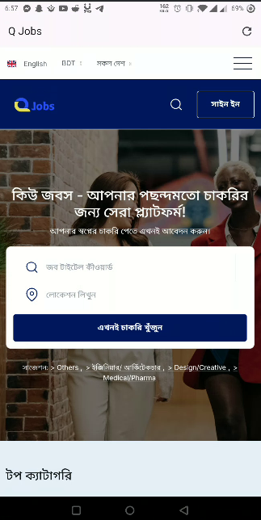

# Q Jobs

🌐 **Q Jobs** - Your gateway to finding the perfect job! This mobile app is a seamless WebView wrapper around the [Q Jobs](https://qjobsbd.com) website, offering all the functionality of the web platform with the convenience of a mobile application.

---

## 📱 App Features

- **WebView Integration**: Experience the full functionality of [Q Jobs](https://qjobsbd.com) right within the app.
- **Domain Restriction**: Ensures navigation is limited to the Q Jobs domain for a secure and focused experience.
- **Custom Splash Screen**: Modern and sleek splash screen for an engaging first impression.
- **Responsive Refresh Button**: Reload pages instantly with the built-in refresh button.
- **Error Handling**: Displays fallback options for web resource errors.

---

## 🚀 Getting Started

### Prerequisites
- **Flutter SDK**: Ensure Flutter is installed ([Get Flutter](https://flutter.dev/docs/get-started/install)).
- **Dart SDK**: Included with the Flutter installation.
- **Android/iOS Device or Emulator**: To run the app.

### Installation

1. Clone the repository:
   ```bash
   git clone https://github.com/shojeeb1943/Q_jobs.git
   cd Q_jobs
   ```

2. Fetch dependencies:
   ```bash
   flutter pub get
   ```

3. Run the app:
   ```bash
   flutter run
   ```

---

## 🛠 Configuration

### Updating Splash Screen
To modify the splash screen, update the configuration in `pubspec.yaml`:
```yaml
flutter_native_splash:
  color: "#ffffff"
  image: assets/icon/splash_image.png
  android: true
  ios: true
  fullscreen: true
```
Then, regenerate the splash screen:
```bash
flutter pub run flutter_native_splash:create
```

### App Icon
Update the app icon by modifying the configuration in `pubspec.yaml` under `flutter_launcher_icons`:
```yaml
flutter_launcher_icons:
  android: true
  ios: true
  image_path: "assets/icon/app_icon.png"
```
Run the following to generate the icons:
```bash
flutter pub run flutter_launcher_icons
```

---

## 🧩 Folder Structure

```
Q_jobs/
├── lib/
│   ├── main.dart  # Entry point of the app
├── assets/
│   ├── icon/  # App icons and splash screen images
├── android/  # Android-specific files
├── ios/      # iOS-specific files
└── pubspec.yaml  # Flutter project configuration
```

---

## 📦 Dependencies

- **Flutter SDK**: `^3.6.1`
- **WebView Flutter**: `^4.10.0`
- **Flutter Native Splash**: `^2.4.4`
- **Flutter Launcher Icons**: `^0.14.2`

---

## ✨ How It Works

1. **WebView**: The app embeds the website `https://qjobsbd.com` using the `webview_flutter` package.
2. **Navigation Restriction**: Users can only navigate within `https://qjobsbd.com`.
3. **Splash Screen**: A custom splash screen ensures a polished user experience.
4. **App Icon**: Fully customizable app icon using `flutter_launcher_icons`.

---

## 📷 Screenshots

| Splash Screen             | Main App View            |
|---------------------------|--------------------------|
|  |  |

---

## 📜 Copyright

This project is copyrighted to **Shojeeb**.

For inquiries, please contact: [shojeeb1943@gmail.com](mailto:shojeeb1943@gmail.com).

---

## 💬 Support

For questions or support, please contact us at [shojeeb1943@gmail.com](mailto:shojeeb1943@gmail.com).

---

## 🎉 Contribute

We welcome contributions to improve Q Jobs! Feel free to submit a pull request or open an issue.

---

**Made with ❤️ using Flutter.**
